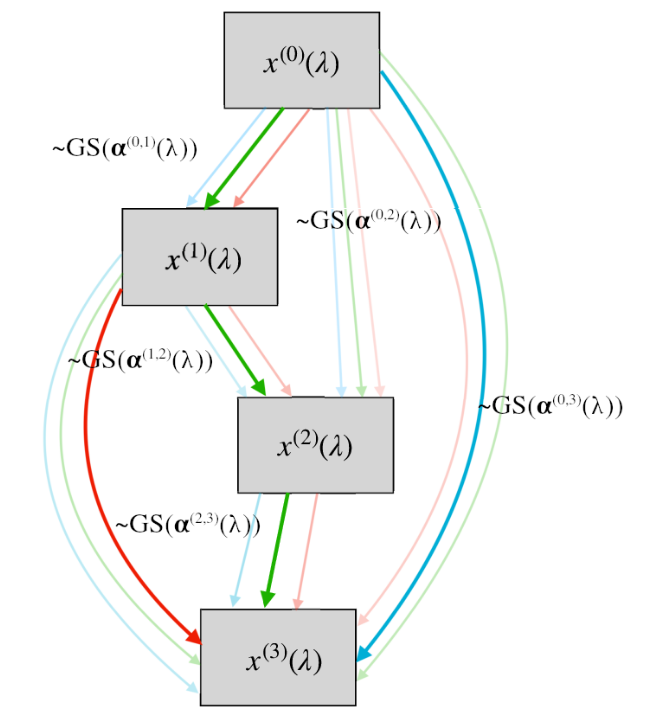

# Neural architecture search with structure complexity control

Authors: [Konstantin Yakovlev](https://github.com/Konstantin-Iakovlev), [Olga Grebenkova](https://github.com/GrebenkovaO), [Oleg Bakhteev](https://github.com/bahleg) and [Vadim Strijov](https://github.com/Strijov).

Contacts: iakovlev.kd(at)phystech.edu

**Table of contests**
* [Annotation](#annotation)
* [Technical details](#technical-details)
* [Environment preparation](#environment-preparation)
* [Toy experiments](#toy-experiments)
* [Large-scale experiment on CIFAR-10](#large-scale-experiment-on-cifar-10)
## Annotation
The paper investigates the problem of deep learning model selection. We propose a method of a neural architecture search with respect to the desired model  complexity. An amount of parameters in the model is considered as a model complexity. The proposed method is based on a differential architecture search algorithm (DARTS). Instead of optimizing structural parameters of the architecture, we consider them as a function depending on the complexity parameter. It enables us to obtain multiple architectures at one optimization procedure and select the architecture based on our computation budget.  To evaluate the performance of the proposed algorithm, we conduct experiments on the Fashion-MNIST and CIFAR-10 datasets and compare the resulting architecture with architectures obtained by other neural architecture search  methods.


The main idea of our paper is to propose a modification of the DARTS algorithm: instead of using constant structure parameters α^{(i,j)} that control the model architecture we propose to consider them as functions on the model complexity parameter λ. We also use Gumbel-softmax distribution for sampling non-linear operations instead of using softmax function on the structure parameters α^{(i,j)}: this gives us the relaxed architecture very close to the target discrete one.

## Technical details
The core of our NAS implementation is based on the [pt.darts, reimplementation of the DARTS method](https://github.com/khanrc/pt.darts) with some bug fixes (see issues in the original repository).

The main logic of the proposed method can be found at [cnn_darts_hypernet package](models/cnn_darts_hypernet).

We do not use augment.py for the architecture fine-tuning, instead we use search.py with some class changes (see [one_hot_cnn.py](models/cnn/one_hot_cnn.py)) for better model training transparency. The one-hot model takes ".json" file with model structure obtained during NAS. We put one-hot non-trainable tensors into the model architecture for the fine-tuning.

All the experiment details are stored into config files, see [configs directory](configs).
## Environment preparation
One can run the experiments in 2 regimes: locally or via Docker. We recommend to use Docker for better reproducibility.

### Local run
To run experiments locally just install packages listed in [requirements.txt](requirements.txt).
```
pip3 install -r requirements.txt
```

### Docker run
To run experiments via Docker you need to build Docker image from the [Dockerfile](Dockerfile).
Note that the docker was configured for the pytorch 1.8.1 distributed for CUDA 11.1. Depending on your hardware, you need to change this dependency in [Dockerfile](Dockerfile). 

To build docker image you can run build_docker.sh:
```
bash build_docker.sh
```

To run the experiments inside docker you should run docker container with opened port for jupyter notebook and shared volume:
```
docker run -p 8888:8888 -v /data/:/nas/searchs -d  --name nas nas-hypernets
docker exec -it nas /bin/bash
```
## Toy experiments
Generally the pipeline is similar for both FashionMNIST and CIAFR. Here we describe the reproduction for the FashionMNIST experiments.
### Random search
1. Generate random architectures (genotypes) for the models using the [notebook](analysis/hyper/generate_genotypes.ipynb) or just use [already generated genotypes](configs/mini_fmnist_hyper_final)
2. Run fine-tuning with [random architectures config](configs/mini_fmnist_hyper_final/fmnist_random.cfg):
```python3 search.py configs/mini_fmnist_hyper_final/fmnist_random.cfg ```
3. The resulting models will be stored at your search/mini_fmnist_random directory.

### DARTS
*The first 2 steps are required for neural architecture search and architectures extraction. We stored obtained architectures [into configs directory](configs/mini_fmnist_hyper_final), so generally you don't need to run search, only fine-tuning.*

1. Run search with [DARTS config](configs/mini_fmnist_hyper_final/fmnist.cfg):
```python3 search.py configs/mini_fmnist_hyper_final/fmnist_random.cfg ```
2. Extract genotypes using script:
```python3 analysis/hyper/run_genotypes_mini_fmnist_darts.py```
3. Run fine-tuning with [DARST fine-tuning config](configs/mini_fmnist_hyper_final/fmnist_fine_darts.cfg)
4. The resulting models will be stored at your search/mini_fmnist_fine_darts directory.

### Proposed method
*The first 2 steps are required for neural architecture search and architectures extraction. We stored obtained architectures [into configs directory](configs/mini_fmnist_hyper_final), so generally you don't need to run search, only fine-tuning.*

1. Run search with [proposed method config](configs/mini_fmnist_hyper_final/fmnist_hyper.cfg):
```python3 search.py configs/mini_fmnist_hyper_final/fmnist_hyper.cfg ```
2. Extract genotypes using script:
```python3 analysis/hyper/run_genotypes_mini_fmnist.py```
3. Run fine-tuning with our fine-tuning configs for different lambdas (we normalize them into [0,1]). For example, for lambda = 0.0 use the following command: 
```python3 search.py configs/mini_fmnist_hyper_final/fmnist_fine_0.cfg```
4. The resulting models will be stored at your search/mini_fmnist_fine_* directories.

### Model analysis
All the model analsysis staff is stored in the [notebook](analysis/hyper/toy_example_fmnist.ipynb).

## Large-scale experiment on CIFAR-10
*The first 2 steps are required for neural architecture search and architectures extraction. We stored obtained architectures [into configs directory](configs/cifar_hyper_final), so generally you don't need to run search, only fine-tuning.*

1. Run search with [proposed method config](configs/cifar_hyper_final/cifar_hyper.cfg):
```python3 search.py configs/cifar_hyper_final/cifar_hyper.cfg```
2. Extract genotypes using script:
```python3 analysis/hyper/run_genotypes_cifar.py```
3. Run fine-tuning with our fine-tuning configs for different lambdas (we normalize them into [0,1]). For example, for lambda = 0.0 use the following command: 
```python3 search.py configs/cifar_hyper_final/cifar_fine_0.cfg```
4. The resulting models will be stored at your search/cifar_fine_* directories.
